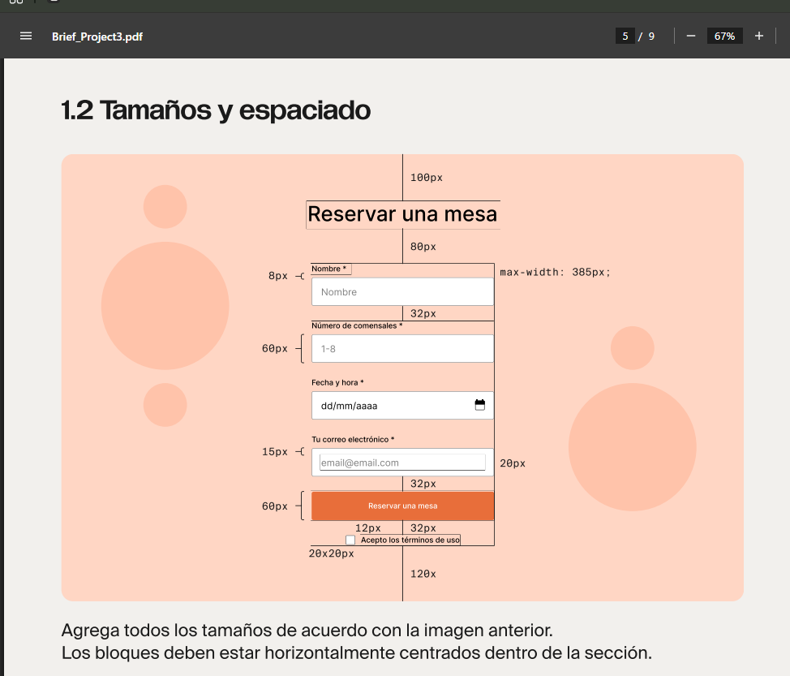
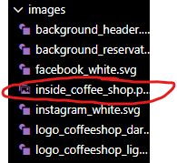
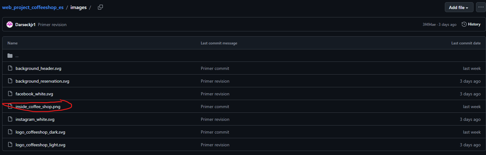

Nombre del proyecto: "Triple Espresso"
Descripción del proyecto: Pagina web de un cafe con capacidad para reservar una mesa
Planes de mejora del proyecto: Agregar estilo a la checkbox, agregar a donde se envia del formulario.
Tegnologias usadas: HTML semántico, CSS, Flexbox, posicionamiento, Google Fonts, normalize, prettier, Gitbash.

Hola Juan, te escribo esto para que veas lo que me pide el brief.
en el brief aparece que el checkbox esta debajo del boton submit como se muestra en la imagen

tambien me pususte que la imagen inside_coffe_shop.png no esta pero si esta igual te dejo las pruebas

Gracias
